# Authentication Architecture

The OpenAPI MCP authentication system has been completely redesigned to eliminate critical security vulnerabilities while maintaining compatibility with existing APIs.

## 🚨 Critical Security Fix

### The Problem (BEFORE)
The original authentication system had a **critical vulnerability**:

```go
// DANGEROUS - Global State Mutation (REMOVED)
func setupLegacyEnvVars(authCtx *auth.AuthContext) {
    switch authCtx.AuthType {
    case "bearer":
        os.Setenv("BEARER_TOKEN", authCtx.Token)  // 🚨 RACE CONDITION
    case "apiKey":
        os.Setenv("API_KEY", authCtx.Token)       // 🚨 GLOBAL STATE MUTATION
    }
}
```

**Security Issues**:
- **Race Conditions**: Multiple concurrent requests would overwrite each other's tokens
- **Global State Pollution**: Environment variables shared across all requests
- **Token Leakage**: Authentication tokens could leak between requests
- **Thread Safety**: No protection against concurrent access

### The Solution (AFTER)
Secure, context-based authentication:

```go
// SECURE - Context-Based Authentication
func secureAuthContextFunc(ctx context.Context, r *http.Request, doc *openapi3.T, spec *models.OpenAPISpec) context.Context {
    authCtx := auth.CreateAuthContext(r, doc, spec)
    return auth.WithAuthContext(ctx, authCtx)  // ✅ REQUEST-SCOPED
}
```

## Secure Authentication Flow


## Authentication Context Architecture

### Context Flow

```mermaid
graph TB
    subgraph "Request Scope"
        Request[HTTP Request]
        Headers[Auth Headers]
        Spec[OpenAPI Spec]
        
        Request --> AuthContext
        Headers --> AuthContext
        Spec --> AuthContext
        
        AuthContext[Auth Context]
        AuthContext --> Provider[Auth Provider]
        Provider --> APICall[API Call]
    end
    
    subgraph "No Global State"
        NoEnv[❌ No os.Setenv]
        NoGlobal[❌ No Global Variables]
        NoMutation[❌ No State Mutation]
    end
    
    AuthContext -.-> NoEnv
    AuthContext -.-> NoGlobal
    AuthContext -.-> NoMutation
```


### Component Breakdown

#### 1. Auth Context Creation
**Location**: `pkg/auth/context.go`

```go
type AuthContext struct {
    Token    string  // Authentication token
    AuthType string  // "bearer", "apiKey", "basic"
    Endpoint string  // API endpoint identifier
}

func CreateAuthContext(r *http.Request, doc *openapi3.T, spec *models.OpenAPISpec) *AuthContext {
    authCtx := &AuthContext{}
    
    // Extract endpoint from path (thread-safe)
    authCtx.Endpoint = extractEndpointFromPath(r.URL.Path)
    
    // Determine auth type from spec (no global state)
    _, authType, _ := ExtractAuthSchemeFromSpec(doc)
    authCtx.AuthType = authType
    
    // Get token from spec or headers (request-scoped)
    authCtx.Token = extractTokenFromRequest(r, spec)
    
    return authCtx
}
```

#### 2. Secure Auth Provider
**Location**: `pkg/auth/secure.go`


```go
type SecureAuthProvider interface {
    GetAuthHeaders(ctx context.Context) map[string]string
    GetAuthQueryParams(ctx context.Context) map[string]string
}

func (p *contextAuthProvider) GetAuthHeaders(ctx context.Context) map[string]string {
    authCtx, ok := FromContext(ctx)  // Extract from context (safe)
    if !ok || authCtx.Token == "" {
        return nil
    }

    headers := make(map[string]string)
    switch authCtx.AuthType {
    case "bearer":
        headers["Authorization"] = "Bearer " + authCtx.Token
    case "apiKey":
        headers["X-API-Key"] = authCtx.Token
    case "basic":
        headers["Authorization"] = "Basic " + authCtx.Token
    }
    
    return headers  // No global state involved!
}
```

## Authorization Header Flow

### Authorization Header Processing Priority
The system processes authorization headers in a specific order to ensure maximum compatibility:


### Authorization Header Security Implementation
```go
func extractAuthFromHeaders(r *http.Request, authType string) string {
    switch authType {
    case "bearer":
        if authHeader := r.Header.Get("Authorization"); authHeader != "" {
            if strings.HasPrefix(authHeader, "Bearer ") {
                return strings.TrimPrefix(authHeader, "Bearer ")
            }
        }
    case "basic":
        if authHeader := r.Header.Get("Authorization"); authHeader != "" {
            if strings.HasPrefix(authHeader, "Basic ") {
                return strings.TrimPrefix(authHeader, "Basic ")
            }
        }
    case "apiKey":
        // Try multiple header variations
        headers := []string{
            "X-API-Key",
            "Api-Key", 
            "x-rapidapi-key",
            "Authorization",
        }
        for _, header := range headers {
            if value := r.Header.Get(header); value != "" {
                return value
            }
        }
    }
    return ""
}
```

## Authentication Types Support

### Bearer Token Authentication


### API Key Authentication


### Basic Authentication
```mermaid
graph LR
    Request[HTTP Request]
    Context[Auth Context]
    BasicHeader[Authorization: Basic base64(user:pass)]
    API[External API]
    
    Request --> Context
    Context --> BasicHeader
    BasicHeader --> API
```

## Advanced Authentication Features

### Multi-Tenant Authentication
The system supports multiple APIs with different authentication schemes simultaneously:


### Dynamic Authentication Resolution
Authentication parameters are resolved dynamically based on the target API specification:


## Authentication Token Management

### Token Storage Hierarchy
The system uses a hierarchical approach to token storage and retrieval:


### Token Lifecycle Management


## Security Hardening Features

### Request Isolation and Security
Each request maintains complete isolation from other concurrent requests:


### Credential Security Best Practices
The authentication system implements multiple layers of credential protection:


## OAuth 2.0 and Advanced Authentication

### OAuth 2.0 Flow Support
While the current implementation focuses on simpler authentication methods, the architecture supports OAuth 2.0 extension:


### JWT Token Processing
Support for JWT (JSON Web Token) authentication with validation:

```mermaid
graph TB
    subgraph "JWT Processing Pipeline"
        JWTToken[JWT Token]
        HeaderParse[Parse JWT Header]
        PayloadParse[Parse JWT Payload]
        SignatureVerify[Verify Signature]
        
        subgraph "Validation Checks"
            ExpiryCheck[Check Expiry (exp)]
            IssuerCheck[Verify Issuer (iss)]
            AudienceCheck[Check Audience (aud)]
            ScopeCheck[Validate Scopes]
        end
        
        subgraph "Security Validation"
            AlgorithmCheck[Algorithm Validation]
            KeyValidation[Key Validation]
            ReplayProtection[Replay Protection]
            NonceValidation[Nonce Validation]
        end
        
        ValidToken[Valid JWT Token]
        AuthContext[Authentication Context]
        
        JWTToken --> HeaderParse
        JWTToken --> PayloadParse
        JWTToken --> SignatureVerify
        
        HeaderParse --> AlgorithmCheck
        PayloadParse --> ExpiryCheck
        PayloadParse --> IssuerCheck
        PayloadParse --> AudienceCheck
        PayloadParse --> ScopeCheck
        SignatureVerify --> KeyValidation
        
        AlgorithmCheck --> ValidToken
        ExpiryCheck --> ValidToken
        IssuerCheck --> ValidToken
        AudienceCheck --> ValidToken
        ScopeCheck --> ValidToken
        KeyValidation --> ValidToken
        
        ValidToken --> AuthContext
    end
```

## Authentication Monitoring and Observability

### Authentication Metrics and Monitoring
Comprehensive monitoring of authentication events and performance:


### Security Event Logging
Structured logging for all authentication events:

```go
// Authentication event logging structure
type AuthEvent struct {
    EventType    string    `json:"event_type"`
    Timestamp    time.Time `json:"timestamp"`
    RequestID    string    `json:"request_id"`
    UserID       string    `json:"user_id,omitempty"`
    Endpoint     string    `json:"endpoint"`
    AuthMethod   string    `json:"auth_method"`
    Success      bool      `json:"success"`
    ErrorCode    string    `json:"error_code,omitempty"`
    ErrorMessage string    `json:"error_message,omitempty"`
    IPAddress    string    `json:"ip_address"`
    UserAgent    string    `json:"user_agent"`
    Duration     int64     `json:"duration_ms"`
}

func logAuthEvent(event AuthEvent) {
    if event.Success {
        log.Printf("AUTH_SUCCESS: %s authenticated via %s for %s (duration: %dms)", 
            event.UserID, event.AuthMethod, event.Endpoint, event.Duration)
    } else {
        log.Printf("AUTH_FAILURE: Authentication failed for %s - %s (error: %s)", 
            event.Endpoint, event.ErrorCode, event.ErrorMessage)
    }
    
    // Send to centralized logging system
    sendToLogAggregator(event)
}
```

## Testing and Validation

### Authentication Testing Strategy
Comprehensive testing approach for authentication components:


### Security Test Cases
```go
// Example security test cases
func TestAuthenticationSecurity(t *testing.T) {
    testCases := []struct {
        name           string
        request        *http.Request
        expectedError  error
        securityLevel  string
    }{
        {
            name: "SQL Injection in Auth Header",
            request: createRequestWithHeader("Authorization", "'; DROP TABLE users; --"),
            expectedError: ErrInvalidToken,
            securityLevel: "critical",
        },
        {
            name: "XSS in API Key",
            request: createRequestWithHeader("X-API-Key", "<script>alert('xss')</script>"),
            expectedError: ErrInvalidToken,
            securityLevel: "high",
        },
        {
            name: "Oversized Token",
            request: createRequestWithHeader("Authorization", strings.Repeat("A", 10000)),
            expectedError: ErrTokenTooLarge,
            securityLevel: "medium",
        },
        {
            name: "Race Condition Test",
            request: createConcurrentRequests(1000),
            expectedError: nil,
            securityLevel: "critical",
        },
    }
    
    for _, tc := range testCases {
        t.Run(tc.name, func(t *testing.T) {
            err := validateAuthenticationSecurity(tc.request)
            assert.Equal(t, tc.expectedError, err)
        })
    }
}
```

## Future Authentication Enhancements

### Planned Security Improvements
Roadmap for additional authentication features:


### Architecture Extensibility
The current authentication architecture is designed for easy extension:


## Security Improvements Summary

### Vulnerabilities Fixed

| Vulnerability | Before | After |
|---------------|--------|-------|
| **Race Conditions** | ❌ `os.Setenv` calls | ✅ Request-scoped context |
| **Global State Mutation** | ❌ Shared environment variables | ✅ Immutable context values |
| **Token Leakage** | ❌ Tokens shared between requests | ✅ Isolated per request |
| **Thread Safety** | ❌ No concurrency protection | ✅ Context-based isolation |
| **Memory Safety** | ❌ Global variable overwrites | ✅ Garbage collected contexts |

### Security Benefits

```mermaid
graph TB
    subgraph "Security Improvements"
        ThreadSafe[Thread Safe Operations]
        NoRace[No Race Conditions]
        Isolated[Request Isolation]
        NoLeak[No Token Leakage]
        
        ThreadSafe --> Secure[🔒 Secure System]
        NoRace --> Secure
        Isolated --> Secure
        NoLeak --> Secure
    end
    
    subgraph "Operational Benefits"
        Concurrent[Concurrent Requests]
        Scalable[Horizontally Scalable]
        Reliable[Reliable Authentication]
        
        Secure --> Concurrent
        Secure --> Scalable
        Secure --> Reliable
    end
```



## Migration Guide

### Code Changes Required

#### Before (Vulnerable)
```go
// OLD - Global state mutation
os.Setenv("BEARER_TOKEN", token)
server := openapi2mcp.NewServer(spec)
```

#### After (Secure)
```go
// NEW - Context-based authentication
authProvider := auth.NewSecureAuthProvider()
contextFunc := auth.SecureAuthContextFunc(authStateManager)
server := server.NewStreamableHTTPServer(srv, 
    server.WithHTTPContextFunc(contextFunc))
```

### Database Integration
The secure authentication system integrates seamlessly with database-driven specs:

```mermaid
graph TB
    subgraph "Database Integration"
        DB[(Database)]
        Spec[OpenAPI Spec]
        Token[API Token]
        Context[Auth Context]
        Request[HTTP Request]
        
        DB --> Spec
        DB --> Token
        Request --> Context
        Spec --> Context
        Token --> Context
        
        Context --> SecureAPI[Secure API Call]
    end
```

### Configuration Priority
Authentication follows a secure priority system:

1. **Database Tokens** (highest priority) - spec-specific tokens
2. **HTTP Headers** - request-specific authentication  
3. **Environment Variables** - fallback for compatibility
4. **Default Configuration** - system defaults

```mermaid
graph TB
    Database[Database Token]
    Headers[HTTP Headers]
    EnvVars[Environment Variables]
    Default[Default Config]
    
    Database --> Headers
    Headers --> EnvVars
    EnvVars --> Default
    
    Database -.-> FinalAuth[Final Auth Context]
    Headers -.-> FinalAuth
    EnvVars -.-> FinalAuth
    Default -.-> FinalAuth
```

## Performance Impact

### Memory Usage
- **Before**: Global variables persisted indefinitely
- **After**: Context values garbage collected per request

### CPU Usage
- **Before**: Mutex contention on global state
- **After**: Lock-free context operations

### Scalability
- **Before**: Serialized authentication due to race conditions
- **After**: Fully concurrent authentication processing

---

*This authentication architecture eliminates critical security vulnerabilities while maintaining API compatibility and improving performance.*