# Data Flow Architecture

This document describes how data flows through the OpenAPI MCP system, from initial requests to final API responses, including all transformations, validations, and optimizations.

## Overall Data Flow Overview

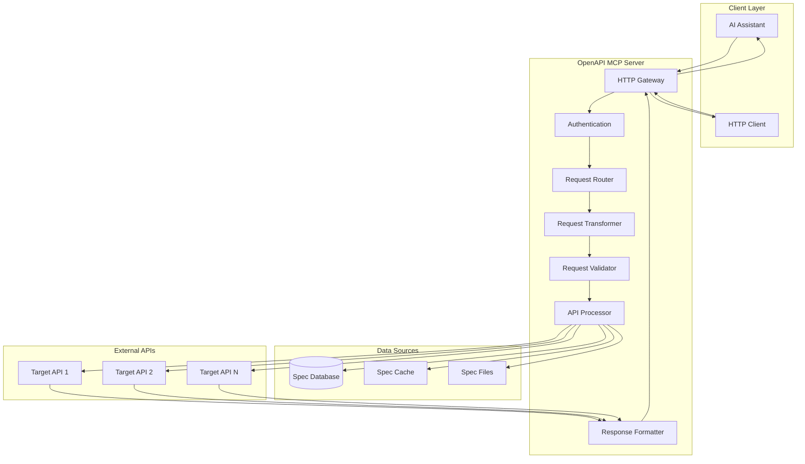

## Request Processing Flow

### 1. Initial Request Receipt
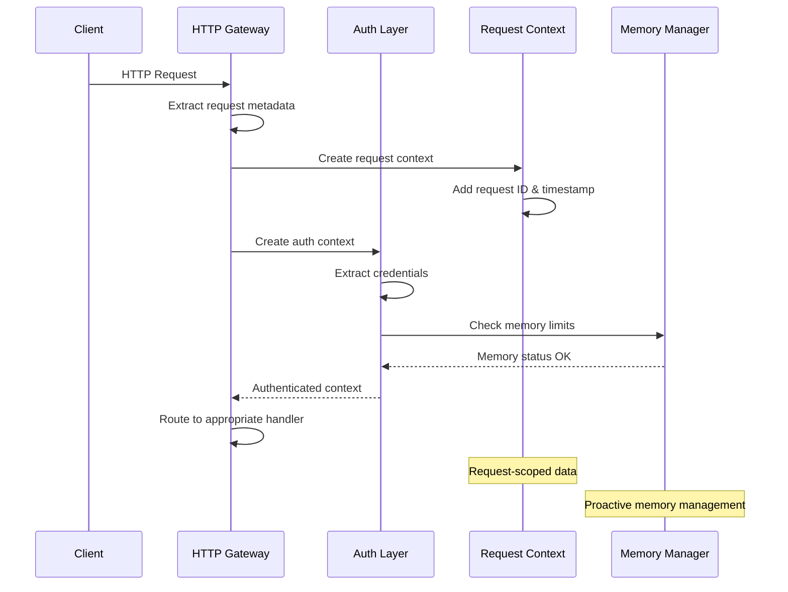

### 2. Specification Loading and Caching
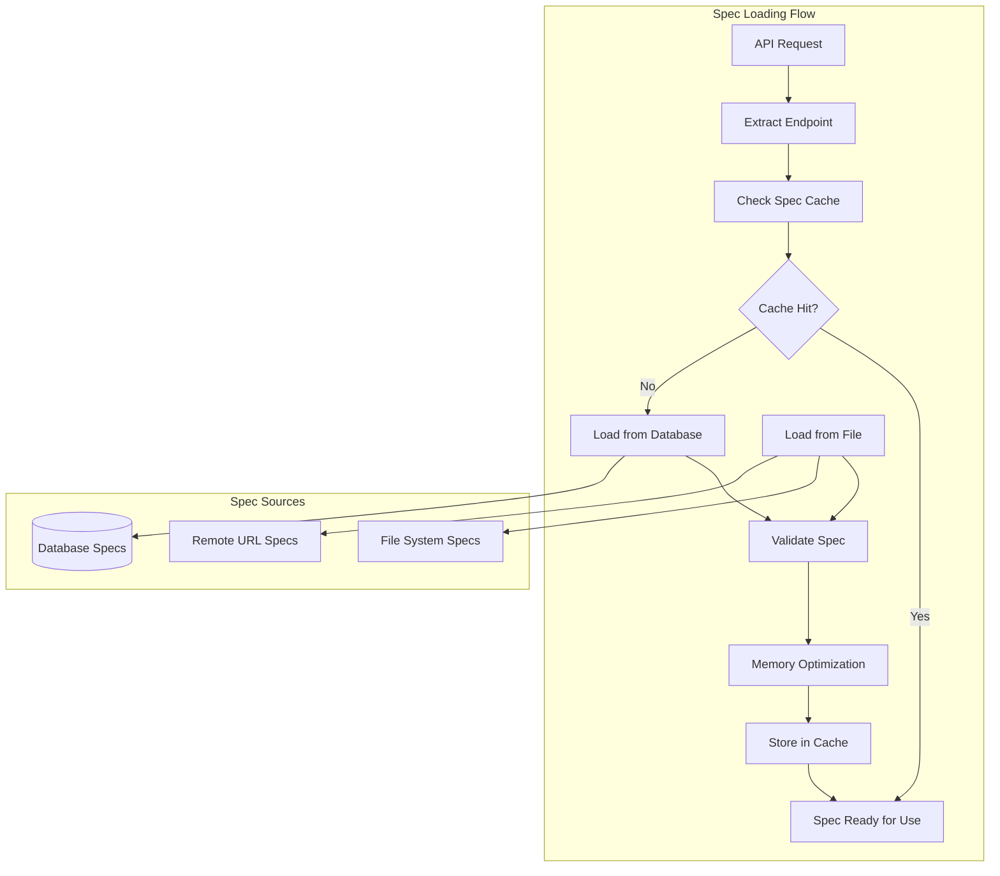

### 3. Request Transformation and Validation
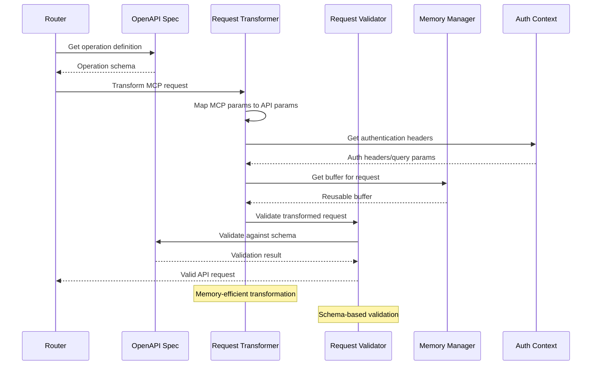

## Data Transformation Layers

### 1. MCP to HTTP Transformation
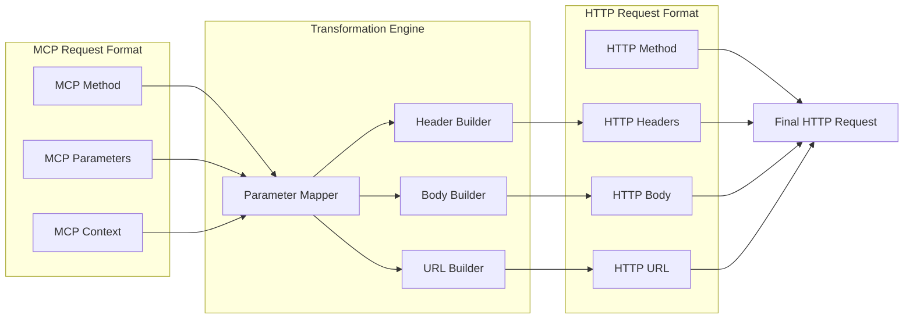

### 2. Authentication Data Flow
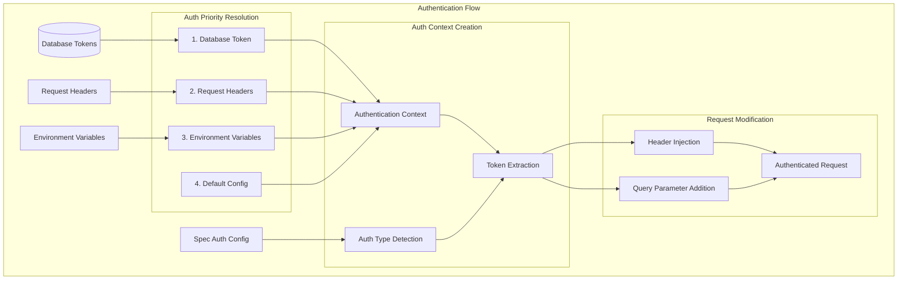

## Memory-Optimized Data Processing

### 1. Large Response Handling
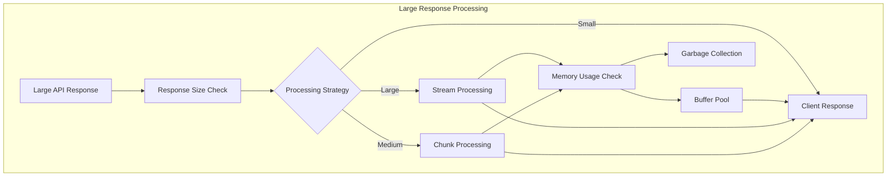

### 2. Streaming Data Pipeline
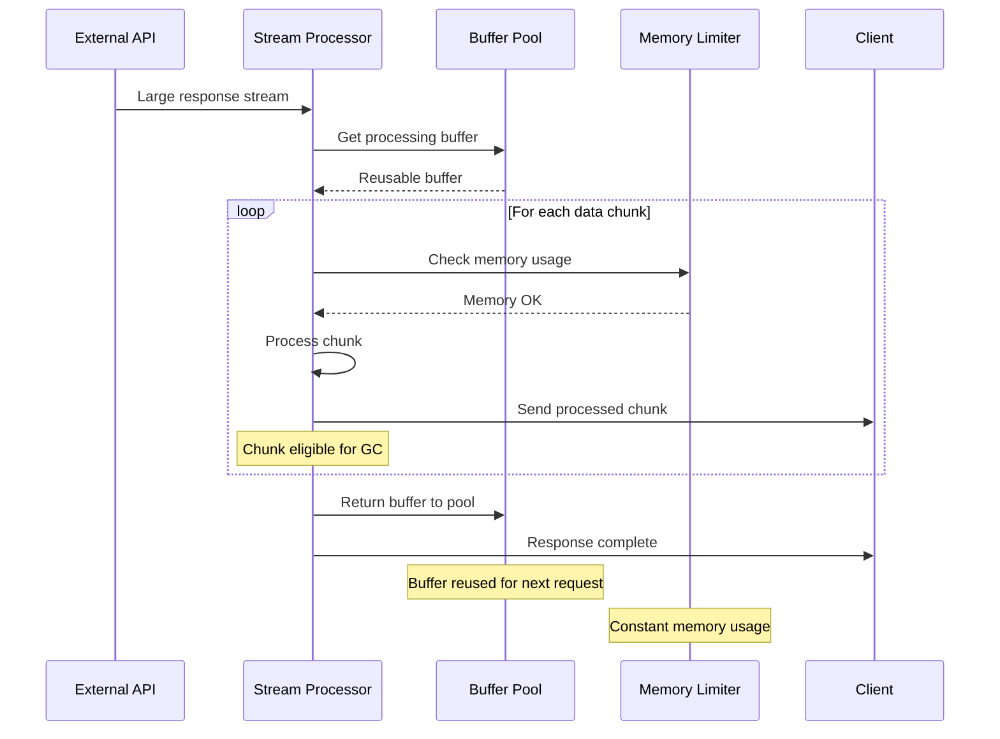

## Database Integration Flow

### 1. Specification Management
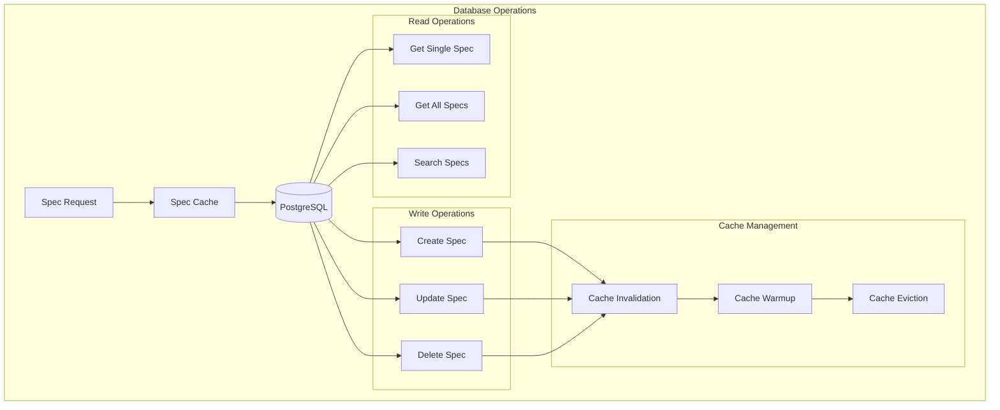

### 2. Authentication Token Management
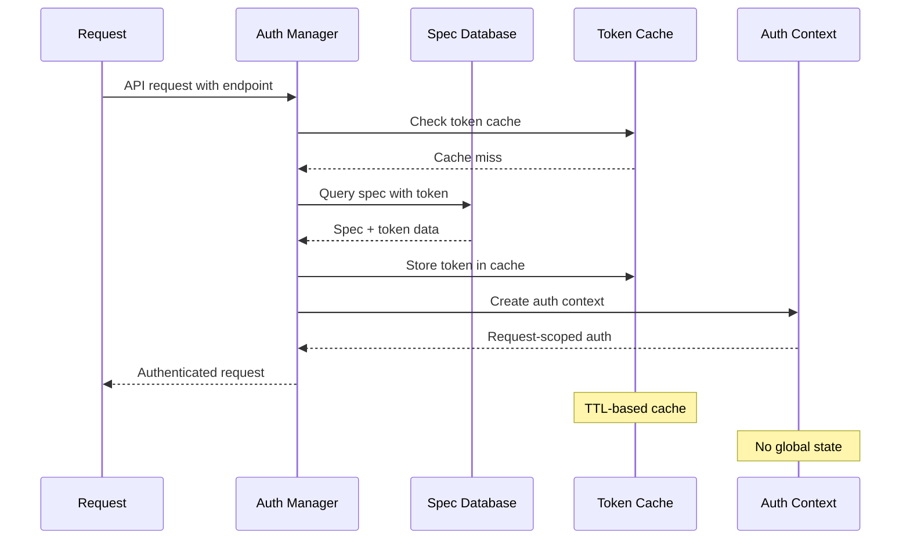

## Error Data Flow

### 1. Error Propagation and Context
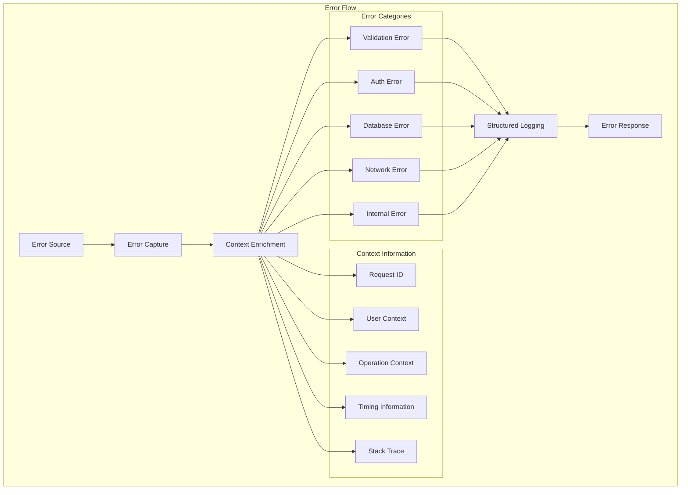

## Performance-Optimized Patterns

### 1. Connection Pooling
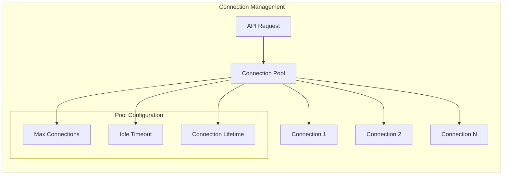

### 2. Response Caching Strategy
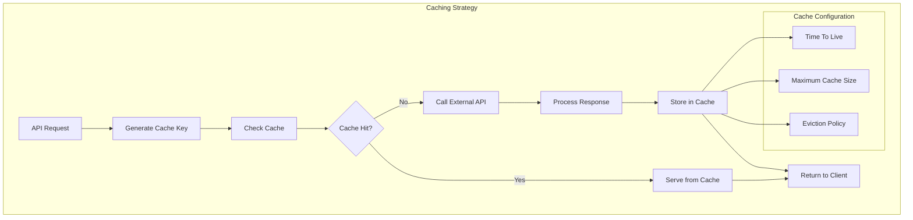

## Monitoring and Observability Data

### 1. Metrics Collection Flow
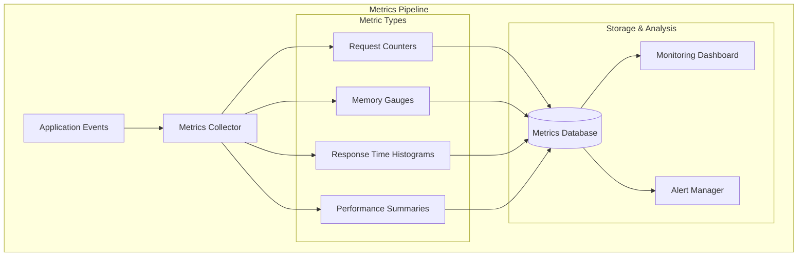

### 2. Distributed Tracing
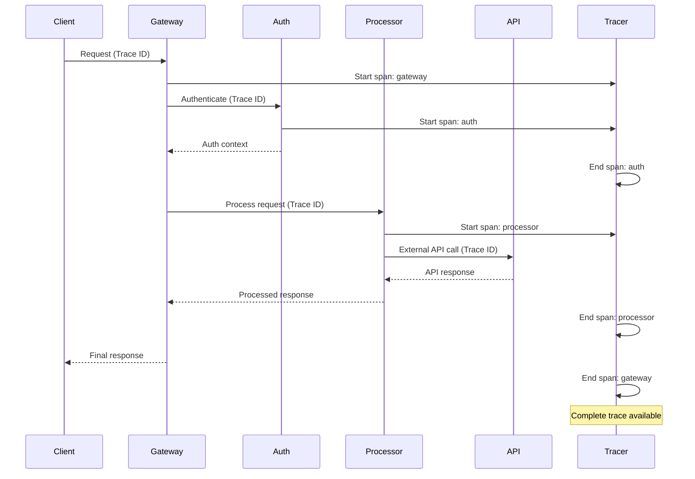

## Configuration Data Flow

### 1. Configuration Loading
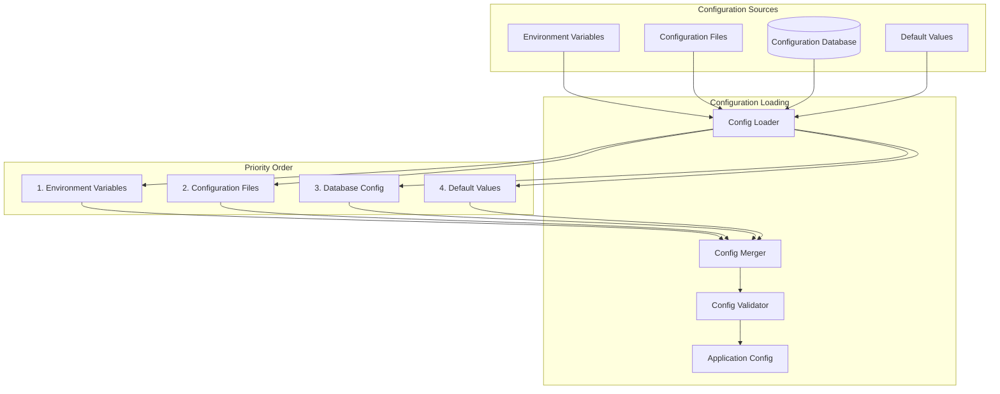

---

*This data flow architecture ensures efficient, secure, and observable data processing throughout the OpenAPI MCP system with proper error handling and performance optimization.*