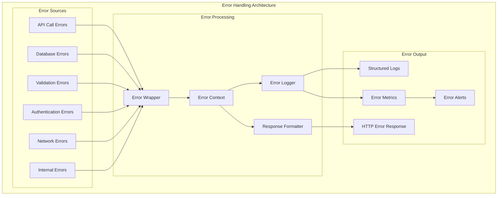
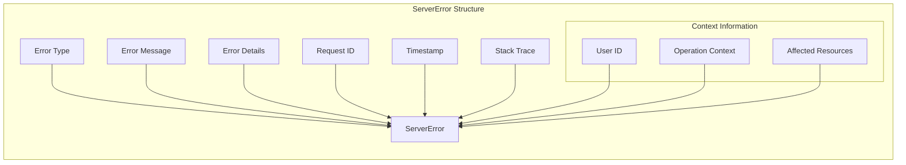
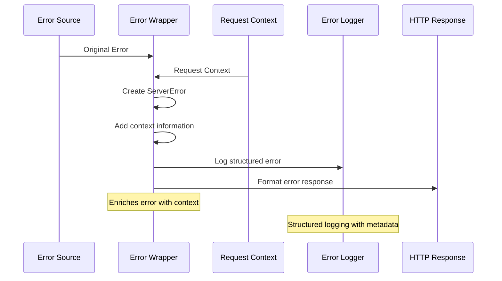
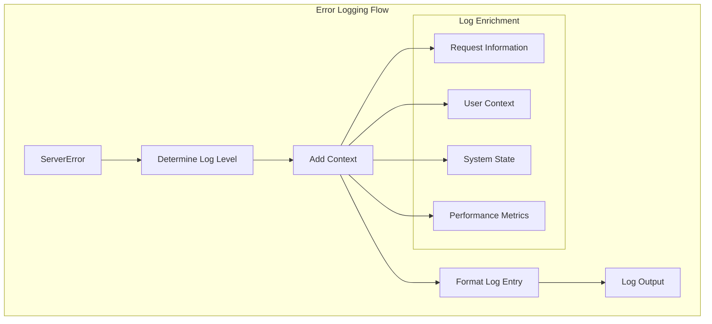
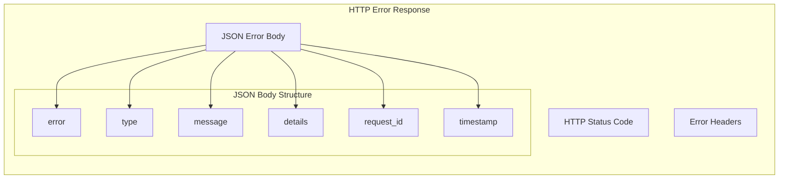
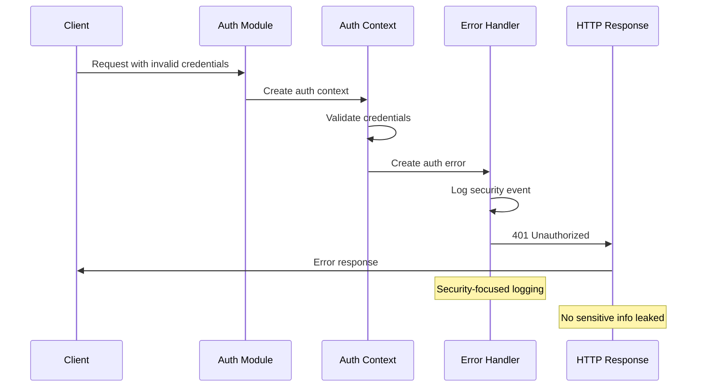
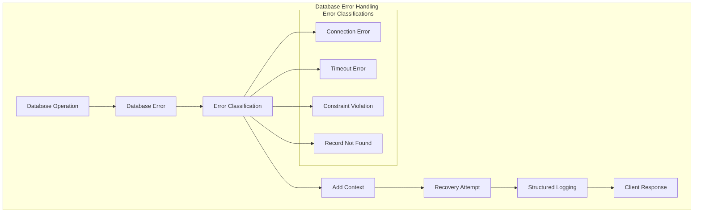
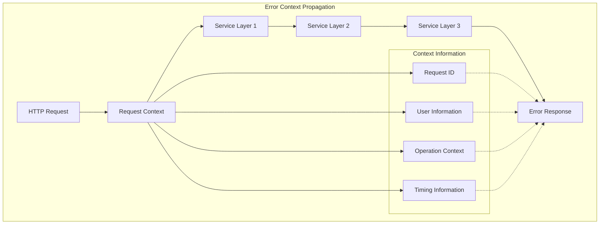
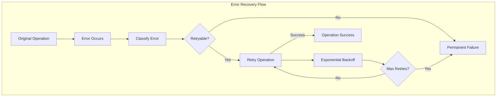
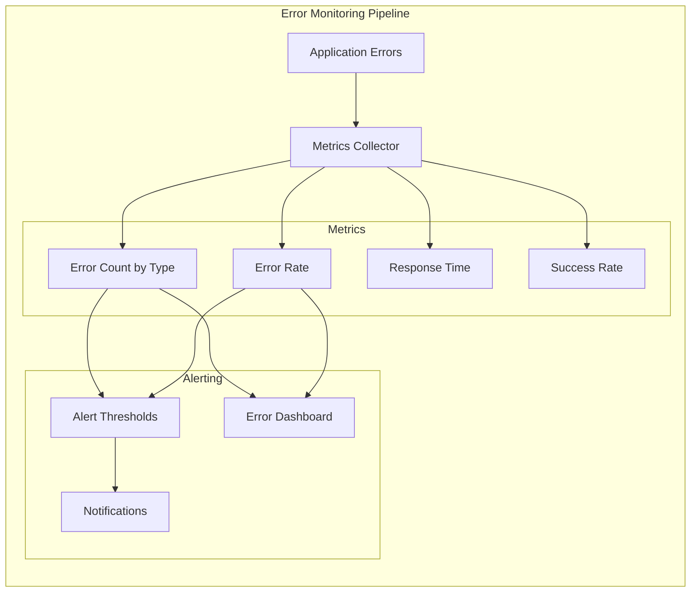

# Error Handling Architecture

The OpenAPI MCP system implements a comprehensive structured error handling system that provides detailed context, tracing, and proper categorization for all error conditions.

## Structured Error System Overview



## Error Type System

### Error Type Definitions
**Location**: `pkg/server/errors.go`

```go
type ErrorType string

const (
    ErrorTypeValidation   ErrorType = "validation"
    ErrorTypeDatabase     ErrorType = "database"
    ErrorTypeAuth         ErrorType = "authentication"
    ErrorTypeNetwork      ErrorType = "network"
    ErrorTypeInternal     ErrorType = "internal"
    ErrorTypeNotFound     ErrorType = "not_found"
    ErrorTypeConflict     ErrorType = "conflict"
)
```

### Structured Error Format



```go
type ServerError struct {
    Type       ErrorType `json:"type"`
    Message    string    `json:"message"`
    Details    string    `json:"details,omitempty"`
    RequestID  string    `json:"request_id,omitempty"`
    Timestamp  int64     `json:"timestamp"`
    StackTrace string    `json:"stack_trace,omitempty"`
}

func (e *ServerError) Error() string {
    if e.Details != "" {
        return fmt.Sprintf("%s: %s (%s)", e.Type, e.Message, e.Details)
    }
    return fmt.Sprintf("%s: %s", e.Type, e.Message)
}
```

## Error Creation and Wrapping

### Error Creation Flow


### Error Creation Methods

#### Creating New Errors
```go
// Create new error with context
func NewErrorWithContext(ctx context.Context, errType ErrorType, message string, details string) *ServerError {
    err := NewError(errType, message, details)
    
    // Extract request ID from context if available
    if requestID, ok := ctx.Value("request_id").(string); ok {
        err.RequestID = requestID
    }
    
    return err
}

// Usage example
func validateAPISpec(ctx context.Context, spec []byte) error {
    if len(spec) == 0 {
        return NewErrorWithContext(ctx, ErrorTypeValidation, 
            "empty API specification", "spec content is required")
    }
    
    // Validation logic...
    return nil
}
```

#### Wrapping Existing Errors
```go
// Wrap existing error with context
func WrapWithContext(ctx context.Context, err error, errType ErrorType, message string) *ServerError {
    if err == nil {
        return nil
    }
    
    return NewErrorWithContext(ctx, errType, message, err.Error())
}

// Usage example
func loadSpecFromDatabase(ctx context.Context, id int) (*Spec, error) {
    spec, err := db.GetSpec(id)
    if err != nil {
        return nil, WrapWithContext(ctx, err, ErrorTypeDatabase, 
            "failed to load API specification")
    }
    
    return spec, nil
}
```

## Error Logging Architecture

### Contextual Logging System


### Log Level Determination
```go
func (e *ServerError) LogError() {
    switch e.Type {
    case ErrorTypeValidation:
        log.Printf("VALIDATION ERROR: %s", e.Error())
    case ErrorTypeAuth:
        log.Printf("AUTH ERROR: %s", e.Error())
    case ErrorTypeDatabase:
        log.Printf("DATABASE ERROR: %s", e.Error())
    case ErrorTypeNetwork:
        log.Printf("NETWORK ERROR: %s", e.Error())
    case ErrorTypeNotFound:
        log.Printf("NOT FOUND: %s", e.Error())
    case ErrorTypeConflict:
        log.Printf("CONFLICT: %s", e.Error())
    default:
        log.Printf("ERROR: %s", e.Error())
    }
    
    if e.StackTrace != "" {
        log.Printf("Stack trace: %s", e.StackTrace)
    }
}
```

## Error Response Formatting

### HTTP Error Response Structure


### Status Code Mapping
```go
func getHTTPStatusCode(errType ErrorType) int {
    switch errType {
    case ErrorTypeValidation:
        return http.StatusBadRequest // 400
    case ErrorTypeAuth:
        return http.StatusUnauthorized // 401
    case ErrorTypeNotFound:
        return http.StatusNotFound // 404
    case ErrorTypeConflict:
        return http.StatusConflict // 409
    case ErrorTypeDatabase:
        return http.StatusInternalServerError // 500
    case ErrorTypeNetwork:
        return http.StatusBadGateway // 502
    default:
        return http.StatusInternalServerError // 500
    }
}
```

### Error Response Example
```json
{
    "error": true,
    "type": "validation",
    "message": "Invalid OpenAPI specification",
    "details": "spec validation failed: missing required field 'openapi'",
    "request_id": "req_123456789",
    "timestamp": 1699123456
}
```

## Error Handling in Different Components

### 1. Authentication Errors


```go
func validateAuthToken(ctx context.Context, token string) error {
    if token == "" {
        return NewErrorWithContext(ctx, ErrorTypeAuth, 
            "authentication required", "no authentication token provided")
    }
    
    if !isValidToken(token) {
        return NewErrorWithContext(ctx, ErrorTypeAuth, 
            "invalid authentication token", "token validation failed")
    }
    
    return nil
}
```

### 2. Database Errors


```go
func getSpecFromDatabase(ctx context.Context, id int) (*models.OpenAPISpec, error) {
    spec, err := db.GetSpec(id)
    if err != nil {
        if err == sql.ErrNoRows {
            return nil, NewErrorWithContext(ctx, ErrorTypeNotFound, 
                "API specification not found", fmt.Sprintf("spec ID %d does not exist", id))
        }
        
        return nil, WrapWithContext(ctx, err, ErrorTypeDatabase, 
            "database query failed")
    }
    
    return spec, nil
}
```

### 3. Validation Errors
```go
func validateOpenAPISpec(ctx context.Context, specContent []byte) error {
    if len(specContent) == 0 {
        return NewErrorWithContext(ctx, ErrorTypeValidation,
            "empty specification", "specification content cannot be empty")
    }
    
    loader := openapi3.NewLoader()
    doc, err := loader.LoadFromData(specContent)
    if err != nil {
        return WrapWithContext(ctx, err, ErrorTypeValidation,
            "invalid OpenAPI specification format")
    }
    
    if err := doc.Validate(ctx); err != nil {
        return WrapWithContext(ctx, err, ErrorTypeValidation,
            "OpenAPI specification validation failed")
    }
    
    return nil
}
```

## Error Propagation and Context

### Context Propagation Pattern


### Context-Aware Error Handling
```go
// Create request context with ID
func createRequestContext(r *http.Request) context.Context {
    requestID := generateRequestID()
    ctx := context.WithValue(r.Context(), "request_id", requestID)
    ctx = context.WithValue(ctx, "start_time", time.Now())
    return ctx
}

// Use context in error creation
func processAPIRequest(ctx context.Context, spec *models.OpenAPISpec) error {
    if err := validateSpec(ctx, spec); err != nil {
        return err // Context already included
    }
    
    if err := loadSpecToCache(ctx, spec); err != nil {
        return WrapWithContext(ctx, err, ErrorTypeInternal,
            "failed to cache specification")
    }
    
    return nil
}
```

## Error Recovery Strategies

### Retry Mechanisms


### Circuit Breaker Pattern
```go
type CircuitBreaker struct {
    failures    int
    maxFailures int
    timeout     time.Duration
    lastFailure time.Time
    state       string // "closed", "open", "half-open"
}

func (cb *CircuitBreaker) Call(ctx context.Context, operation func() error) error {
    if cb.state == "open" {
        if time.Since(cb.lastFailure) > cb.timeout {
            cb.state = "half-open"
        } else {
            return NewErrorWithContext(ctx, ErrorTypeNetwork,
                "circuit breaker open", "service temporarily unavailable")
        }
    }
    
    err := operation()
    if err != nil {
        cb.failures++
        cb.lastFailure = time.Now()
        if cb.failures >= cb.maxFailures {
            cb.state = "open"
        }
        return WrapWithContext(ctx, err, ErrorTypeNetwork, "operation failed")
    }
    
    cb.failures = 0
    cb.state = "closed"
    return nil
}
```

## Error Monitoring and Alerting

### Error Metrics Collection


### Error Analysis
- **Error Patterns**: Identify common error patterns and root causes
- **Performance Impact**: Measure error impact on system performance
- **User Experience**: Track error impact on user operations
- **Trend Analysis**: Monitor error trends over time

---

*This structured error handling architecture provides comprehensive error management with proper context, logging, and recovery strategies for production-ready operations.*