# Memory Optimization Architecture

The OpenAPI MCP system implements comprehensive memory optimization strategies to handle large API specifications and high-throughput operations without memory exhaustion.

## Memory Management Overview


## Core Memory Components

### 1. Buffer Pool System
**Location**: `pkg/memory/pool.go`

The buffer pool system provides reusable memory buffers to eliminate allocation overhead:


#### Byte Pool Implementation
```go
type BytePool struct {
    pool sync.Pool
}

func NewBytePool(initialSize int) *BytePool {
    return &BytePool{
        pool: sync.Pool{
            New: func() interface{} {
                return make([]byte, 0, initialSize)
            },
        },
    }
}

func (bp *BytePool) Get() []byte {
    return bp.pool.Get().([]byte)[:0] // Reset length but keep capacity
}

func (bp *BytePool) Put(b []byte) {
    // Only return large enough slices to avoid memory fragmentation
    if cap(b) >= 1024 {
        bp.pool.Put(b)
    }
}
```

### 2. Memory Limiter
**Location**: `pkg/memory/pool.go`

Monitors and controls memory usage to prevent out-of-memory conditions:


#### Memory Limiter Implementation
```go
type MemoryLimiter struct {
    maxMemoryMB    int64
    checkInterval  int
    operationCount int64
    mu             sync.Mutex
}

func (ml *MemoryLimiter) CheckMemoryUsage() bool {
    ml.mu.Lock()
    defer ml.mu.Unlock()
    
    ml.operationCount++
    
    // Only check memory every N operations to avoid overhead
    if ml.operationCount%int64(ml.checkInterval) != 0 {
        return true
    }
    
    var m runtime.MemStats
    runtime.ReadMemStats(&m)
    
    currentMemoryMB := int64(m.Alloc) / (1024 * 1024)
    
    if currentMemoryMB > ml.maxMemoryMB {
        runtime.GC() // Force garbage collection
        
        // Check again after GC
        runtime.ReadMemStats(&m)
        currentMemoryMB = int64(m.Alloc) / (1024 * 1024)
        
        return currentMemoryMB <= ml.maxMemoryMB
    }
    
    return true
}
```

## Streaming Processing Architecture

### 1. Large JSON Processing
**Location**: `pkg/memory/streaming.go`

Handles large JSON responses without loading everything into memory:


#### Streaming JSON Implementation
```go
func (sjp *StreamingJSONProcessor) ProcessLargeJSON(ctx context.Context, reader io.Reader, callback func(interface{}) error) error {
    decoder := json.NewDecoder(reader)
    decoder.UseNumber() // Handle large numbers safely
    
    var processedCount int
    
    for {
        // Check context cancellation
        select {
        case <-ctx.Done():
            return ctx.Err()
        default:
        }
        
        // Check memory usage periodically
        if processedCount%100 == 0 && !sjp.processor.CheckMemory() {
            return fmt.Errorf("memory usage exceeded limits")
        }
        
        var item interface{}
        if err := decoder.Decode(&item); err != nil {
            if err == io.EOF {
                break // End of stream
            }
            return fmt.Errorf("JSON decode error: %w", err)
        }
        
        // Process the item (memory can be GC'd after this)
        if err := callback(item); err != nil {
            return fmt.Errorf("callback error: %w", err)
        }
        
        processedCount++
    }
    
    return nil
}
```

### 2. Chunked Response Writing
Manages memory usage when writing large responses:


## OpenAPI Spec Optimization

### 1. Memory-Efficient Spec Loading
**Location**: `pkg/memory/openapi.go`

Optimizes OpenAPI specification loading and processing:


#### Spec Memory Optimization
```go
func (mesl *MemoryEfficientSpecLoader) OptimizeSpec(spec *openapi3.T) error {
    // Remove examples from schema to save memory
    if spec.Components != nil && spec.Components.Schemas != nil {
        for _, schemaRef := range spec.Components.Schemas {
            if schemaRef.Value != nil {
                mesl.optimizeSchema(schemaRef.Value)
            }
        }
    }
    
    // Optimize paths by removing examples
    if spec.Paths != nil {
        for _, pathItem := range spec.Paths {
            if pathItem != nil {
                mesl.optimizePathItem(pathItem)
            }
        }
    }
    
    return nil
}

func (mesl *MemoryEfficientSpecLoader) optimizeSchema(schema *openapi3.Schema) {
    // Remove examples to save memory
    schema.Example = nil
    
    // Recursively optimize nested schemas
    if schema.Properties != nil {
        for _, propRef := range schema.Properties {
            if propRef.Value != nil {
                mesl.optimizeSchema(propRef.Value)
            }
        }
    }
}
```

### 2. Spec Compression for Storage
Compresses specifications for efficient storage:


## Batch Processing Architecture

### Large Dataset Handling
Processes large datasets in memory-efficient batches:


#### Batch Processing Implementation
```go
func (ldh *LargeDataHandler) ProcessInBatches(ctx context.Context, data []interface{}, batchSize int, processor func([]interface{}) error) error {
    for i := 0; i < len(data); i += batchSize {
        // Check context cancellation
        select {
        case <-ctx.Done():
            return ctx.Err()
        default:
        }
        
        // Check memory usage
        if !ldh.processor.CheckMemory() {
            return fmt.Errorf("memory usage exceeded limits")
        }
        
        // Create batch
        end := i + batchSize
        if end > len(data) {
            end = len(data)
        }
        
        batch := data[i:end]
        
        // Process batch (memory can be GC'd after this)
        if err := processor(batch); err != nil {
            return fmt.Errorf("batch processing error at index %d: %w", i, err)
        }
    }
    
    return nil
}
```

## Performance Metrics

### Memory Usage Patterns

```mermaid
graph LR
    subgraph "Memory Usage Over Time"
        Time[Time →]
        
        subgraph "Without Optimization"
            Linear[Linear Growth]
            Peak[Memory Peaks]
            OOM[Out of Memory]
        end
        
        subgraph "With Optimization"
            Stable[Stable Usage]
            Controlled[Controlled Peaks]
            Efficient[Memory Efficient]
        end
    end
    
    Linear -.-> Stable
    Peak -.-> Controlled
    OOM -.-> Efficient
```



### Optimization Impact

| Operation | Before Optimization | After Optimization | Improvement |
|-----------|-------------------|-------------------|-------------|
| **Large Spec Loading** | 500MB+ memory | 50MB memory | 90% reduction |
| **JSON Processing** | Linear growth | Constant memory | Prevents OOM |
| **Buffer Operations** | New allocations | Pooled buffers | 80% fewer allocations |
| **Concurrent Requests** | Memory multiplication | Shared pools | 60% memory savings |

## Configuration Examples

### Memory Limiter Configuration
```go
// Configure memory limiter for production
memoryLimiter := memory.NewMemoryLimiter(512) // 512MB limit

// Configure stream processor with chunking
streamProcessor := memory.NewStreamProcessor(256, 8192) // 256MB limit, 8KB chunks

// Configure spec loader with size limits
specLoader := memory.NewMemoryEfficientSpecLoader(512, 100) // 512MB total, 100MB per spec
```

### Buffer Pool Configuration
```go
// Configure pools based on expected load
bytePool := memory.NewBytePool(8192)    // 8KB initial size
bufferPool := memory.NewBufferPool()     // Auto-sizing buffers

// Use pools in processing
func processLargeData() {
    buffer := bytePool.Get()
    defer bytePool.Put(buffer)
    
    // Process data with pooled buffer
}
```

## Monitoring and Observability

### Memory Metrics Collection


### Integration with Application Monitoring
- Memory usage tracking per request
- Pool efficiency metrics
- GC performance monitoring
- Alert thresholds for memory limits

---

*This memory optimization architecture ensures the system can handle large-scale operations while maintaining predictable memory usage and preventing out-of-memory conditions.*