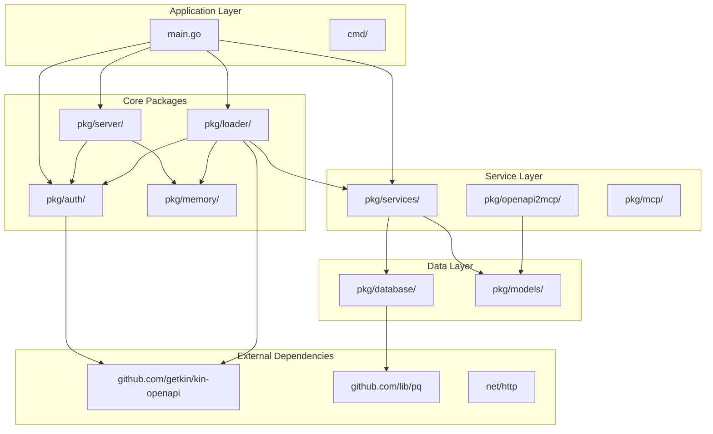
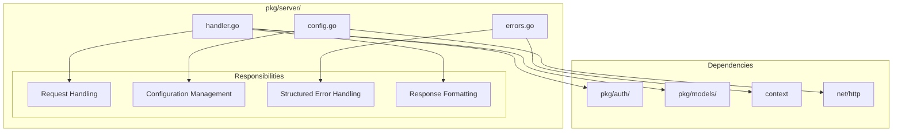
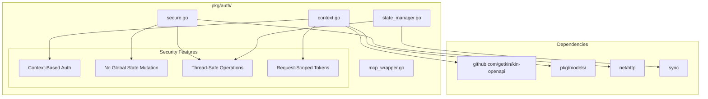
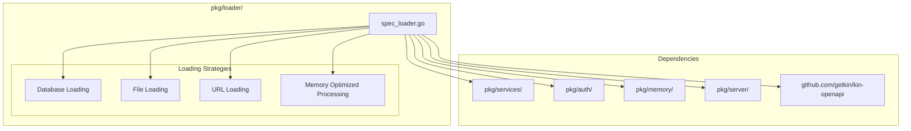
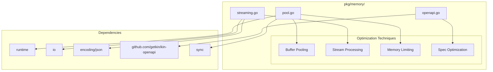
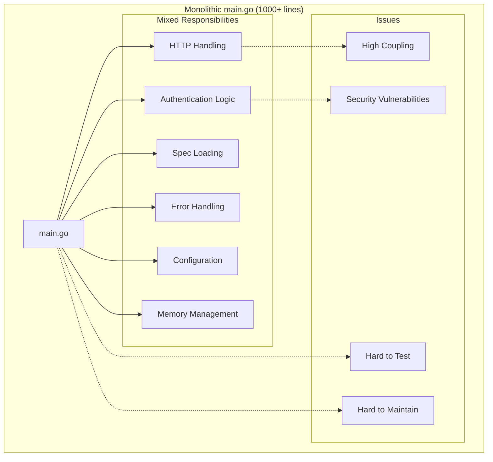
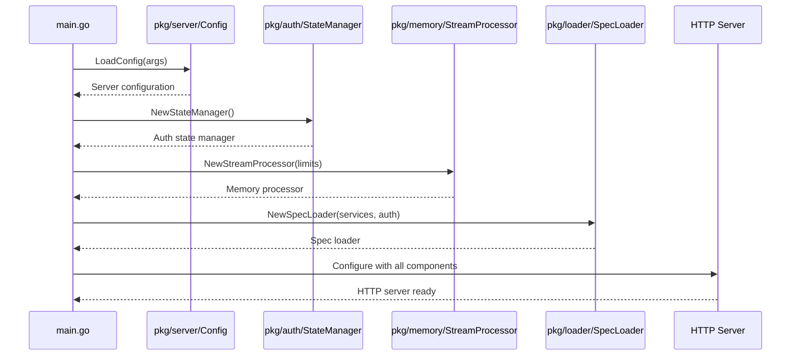
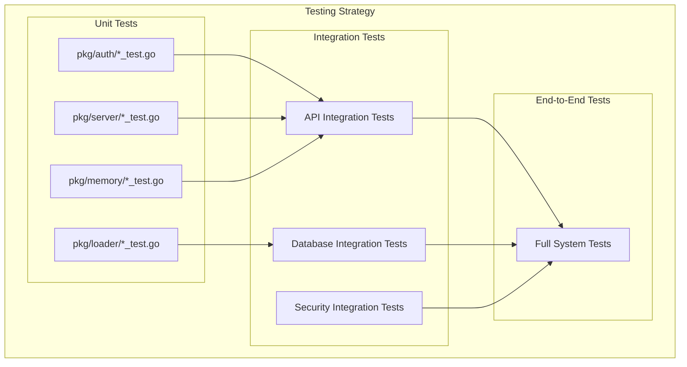

# Module Dependencies Architecture

This document outlines the modular structure and dependency relationships in the refactored OpenAPI MCP system, showing how the monolithic main package was broken down into focused, reusable modules.

## Package Structure Overview



## Module Responsibilities

### 1. `pkg/server/` - HTTP Server Components
**Purpose**: HTTP request handling, configuration, and response management



**Key Components**:
- **handler.go**: HTTP endpoint handlers (health, reload, API list)
- **config.go**: Server configuration management
- **errors.go**: Structured error types with context

### 2. `pkg/auth/` - Authentication System
**Purpose**: Secure, context-based authentication without global state



**Key Components**:
- **context.go**: Authentication context creation and management
- **secure.go**: Secure authentication providers and request modification
- **state_manager.go**: Thread-safe spec-to-auth mapping
- **mcp_wrapper.go**: HTTP client wrappers for secure requests

### 3. `pkg/loader/` - Specification Loading
**Purpose**: Memory-efficient OpenAPI specification loading and management



**Key Components**:
- **spec_loader.go**: Main specification loading logic with memory optimization
- Integration with memory management for large specs
- Support for multiple loading sources (DB, files, URLs)

### 4. `pkg/memory/` - Memory Optimization
**Purpose**: Memory-efficient processing for large datasets and specifications



**Key Components**:
- **pool.go**: Buffer pools and memory limiters
- **streaming.go**: Streaming JSON processing and chunked writing
- **openapi.go**: OpenAPI specification memory optimization

## Dependency Flow Analysis

### Before Refactoring (Monolithic)


### After Refactoring (Modular)
```mermaid
graph TB
    subgraph "Modular Architecture"
        MainNew[main.go (simplified)]
        
        subgraph "Focused Packages"
            ServerPkg[pkg/server/ - HTTP & Config]
            AuthPkg[pkg/auth/ - Security]
            LoaderPkg[pkg/loader/ - Spec Management]
            MemoryPkg[pkg/memory/ - Optimization]
        end
        
        MainNew --> ServerPkg
        MainNew --> AuthPkg
        MainNew --> LoaderPkg
        
        ServerPkg --> AuthPkg
        LoaderPkg --> AuthPkg
        LoaderPkg --> MemoryPkg
        
        subgraph "Benefits"
            LowCoupling[Low Coupling]
            Testable[Easily Testable]
            Maintainable[Maintainable]
            Secure[Security Fixed]
        end
        
        ServerPkg -.-> LowCoupling
        AuthPkg -.-> Secure
        MainNew -.-> Testable
        MainNew -.-> Maintainable
    end
```

## Package Interface Contracts

### 1. Authentication Interface
```go
// pkg/auth/secure.go
type SecureAuthProvider interface {
    GetAuthHeaders(ctx context.Context) map[string]string
    GetAuthQueryParams(ctx context.Context) map[string]string
}

// pkg/auth/context.go
func CreateAuthContext(r *http.Request, doc *openapi3.T, spec *models.OpenAPISpec) *AuthContext
func WithAuthContext(ctx context.Context, authCtx *AuthContext) context.Context
func FromContext(ctx context.Context) (*AuthContext, bool)
```

### 2. Memory Management Interface
```go
// pkg/memory/pool.go
type MemoryLimiter interface {
    CheckMemoryUsage() bool
    GetMemoryStats() (allocMB, sysMB int64)
}

// pkg/memory/streaming.go
type StreamingJSONProcessor interface {
    ProcessLargeJSON(ctx context.Context, reader io.Reader, callback func(interface{}) error) error
}
```

### 3. Server Configuration Interface
```go
// pkg/server/config.go
type Config struct {
    DatabaseMode bool
    HTTPMode     bool
    HTTPAddr     string
    DatabaseURL  string
    Port         int
    SpecFiles    []string
}

func LoadConfig(args []string) (*Config, error)
func (c *Config) Validate() error
```

## Dependency Injection Pattern

### Service Initialization Flow


### Component Lifecycle Management
```go
// Dependency injection in main.go
func initializeComponents(config *serverPkg.Config) (*Components, error) {
    // Initialize core services
    authStateManager := auth.NewStateManager()
    memoryProcessor := memory.NewStreamProcessor(config.MaxMemoryMB, config.ChunkSize)
    
    // Initialize spec loader with dependencies
    specLoader := loader.NewSpecLoader(specLoaderService, authStateManager)
    
    // Create server with all dependencies
    server := createServerWithDependencies(config, authStateManager, specLoader, memoryProcessor)
    
    return &Components{
        AuthManager:     authStateManager,
        MemoryProcessor: memoryProcessor,
        SpecLoader:      specLoader,
        Server:          server,
    }, nil
}
```

## Testing Architecture

### Package-Level Testing


### Testable Component Design
Each package is designed with testing in mind:

```go
// Example: Testable authentication component
func TestSecureAuthProvider(t *testing.T) {
    // Create test context with auth
    ctx := context.Background()
    authCtx := &auth.AuthContext{
        Token:    "test-token",
        AuthType: "bearer",
        Endpoint: "test-api",
    }
    ctx = auth.WithAuthContext(ctx, authCtx)
    
    // Test provider
    provider := auth.NewSecureAuthProvider()
    headers := provider.GetAuthHeaders(ctx)
    
    assert.Equal(t, "Bearer test-token", headers["Authorization"])
}
```

## Migration Path

### From Monolithic to Modular
1. **Extract Interfaces**: Define clear interfaces for each component
2. **Move Code**: Relocate code to appropriate packages
3. **Update Imports**: Change import statements to use new packages
4. **Inject Dependencies**: Pass components as dependencies rather than globals
5. **Test Integration**: Ensure all components work together

### Backward Compatibility
The refactored architecture maintains API compatibility:
- External APIs remain unchanged
- Configuration format is preserved
- Database schema is unmodified
- MCP protocol compliance is maintained

---

*This modular architecture provides clear separation of concerns, improved testability, and better maintainability while eliminating security vulnerabilities.*