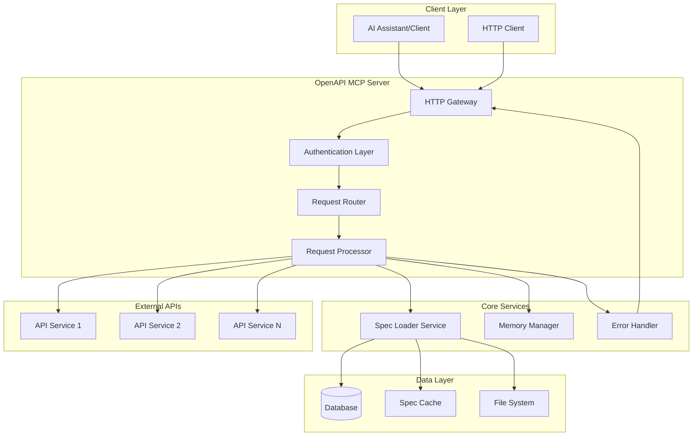
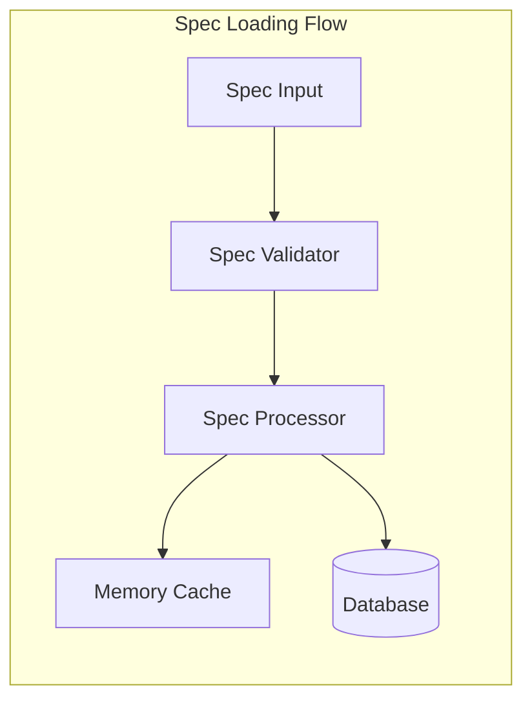
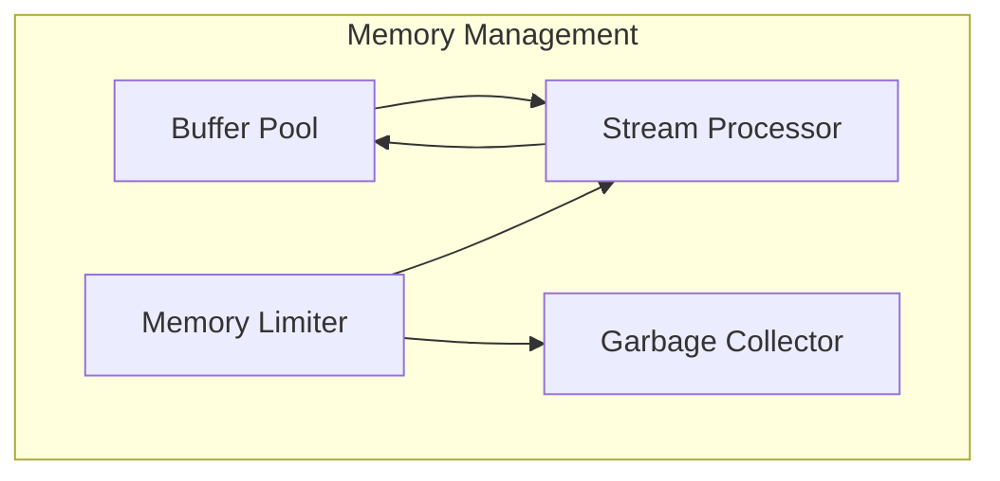
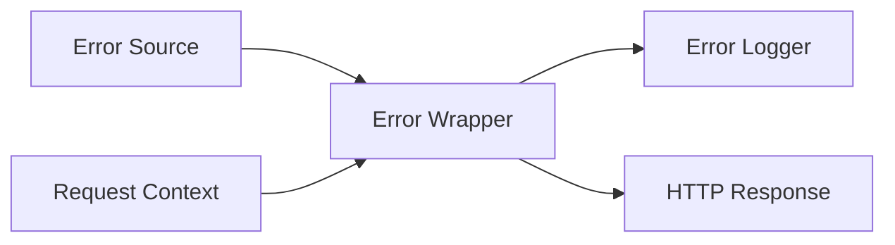
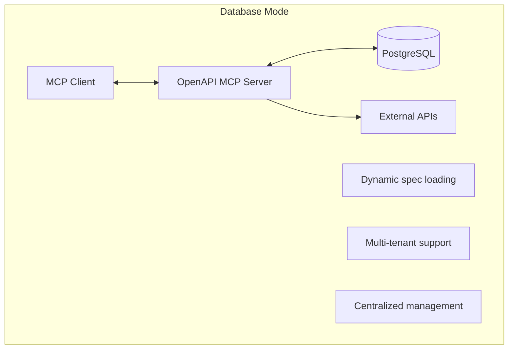
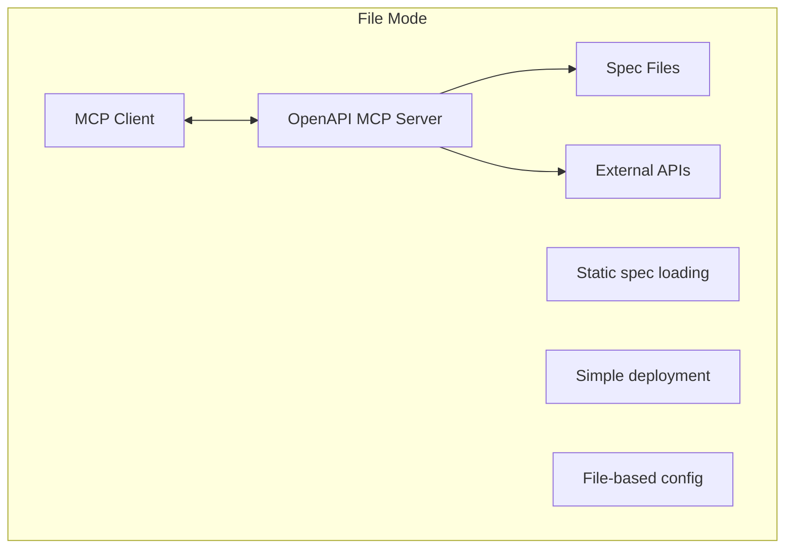
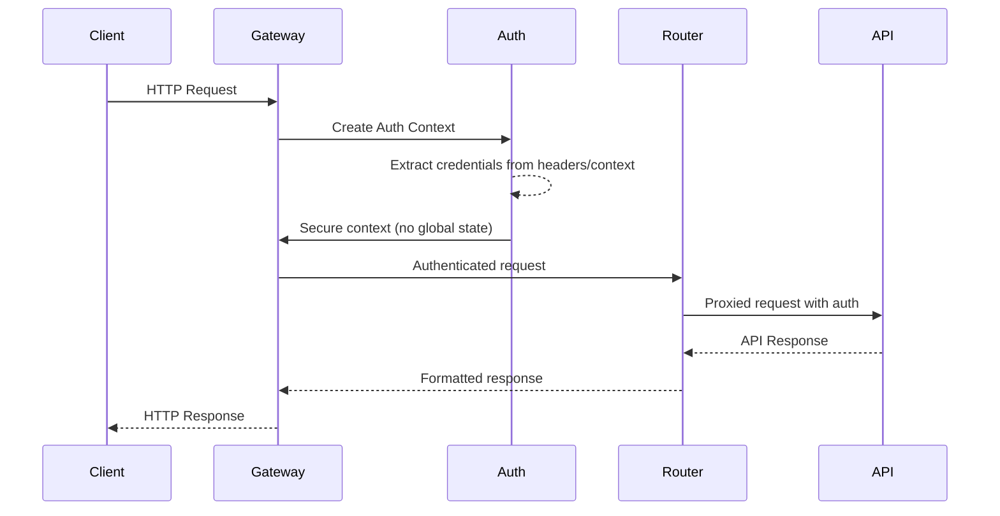

# System Overview

The OpenAPI MCP system transforms OpenAPI specifications into Model Context Protocol (MCP) servers, enabling AI assistants to interact with APIs through a standardized interface.

## High-Level Architecture

## System Components

### 1. HTTP Gateway
**Location**: `main.go` (being refactored)
**Purpose**: Entry point for all HTTP requests
- Handles both MCP protocol and HTTP API requests
- Manages server lifecycle and graceful shutdown
- Provides health check and management endpoints

### 2. Authentication Layer
**Location**: `pkg/auth/`
**Purpose**: Secure, context-based authentication
- **SECURITY FIX**: Eliminates global state mutation
- Request-scoped authentication context
- Support for Bearer, API Key, and Basic authentication
- Thread-safe operation with no race conditions

### 3. Request Router
**Location**: `pkg/server/handler.go`
**Purpose**: Routes requests to appropriate handlers
- Dynamic API endpoint registration
- Spec-based routing configuration
- Error handling and response formatting

### 4. Request Processor
**Location**: `pkg/openapi2mcp/`
**Purpose**: Processes API calls according to OpenAPI specs
- Validates requests against specifications
- Transforms MCP calls to API requests
- Handles response mapping and error translation

## Core Services

### Spec Loader Service
**Location**: `pkg/loader/` & `pkg/services/`
**Purpose**: Manages OpenAPI specification loading and caching

**Features**:
- Database-driven spec management
- File-based spec loading
- Automatic spec validation
- Memory-efficient caching

### Memory Manager
**Location**: `pkg/memory/`
**Purpose**: Optimizes memory usage for large API operations

**Features**:
- Reusable buffer pools
- Memory usage monitoring
- Streaming processing for large datasets
- Automatic garbage collection triggers

### Error Handler
**Location**: `pkg/server/errors.go`
**Purpose**: Structured error handling with context

## Deployment Modes

### Database Mode

**Features**:
- Dynamic specification loading
- Multi-API support in single instance
- Centralized configuration management
- Real-time spec updates

### File Mode

**Features**:
- Simple file-based configuration
- Direct spec file loading
- Lightweight deployment
- No database dependency

## Security Architecture

### Request Flow Security

### Authentication Security Improvements
- **Before**: Global `os.Setenv` calls causing race conditions
- **After**: Request-scoped context with thread-safe operations
- **Benefit**: Eliminates security vulnerabilities in concurrent environments

## Performance Characteristics

### Memory Usage
- **Buffer Pooling**: Reuse buffers for repeated operations
- **Streaming**: Process large datasets without loading entirely into memory
- **Garbage Collection**: Proactive memory management

### Concurrency
- **Thread Safety**: All components designed for concurrent access
- **No Global State**: Eliminates race conditions
- **Context Propagation**: Request-scoped data flow

### Scalability
- **Horizontal**: Multiple server instances with shared database
- **Vertical**: Memory-efficient processing of large specifications
- **Resource Management**: Automatic resource cleanup and optimization

## Migration Notes

### From Previous Architecture
1. **Authentication**: Replace global env var usage with context-based auth
2. **Error Handling**: Migrate from simple errors to structured error types
3. **Memory Management**: Implement buffer pooling for large operations
4. **Modularity**: Move functionality from main.go to focused packages

### Breaking Changes
- Authentication context API changes
- Error type changes (now structured)
- Memory management requires explicit buffer management
- Package imports updated due to restructuring

---

*This overview reflects the current architecture after security fixes and performance optimizations.*